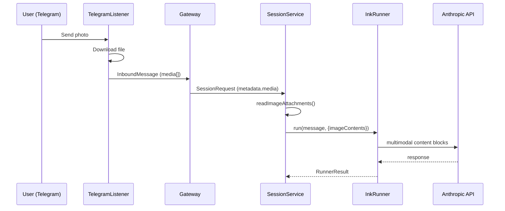
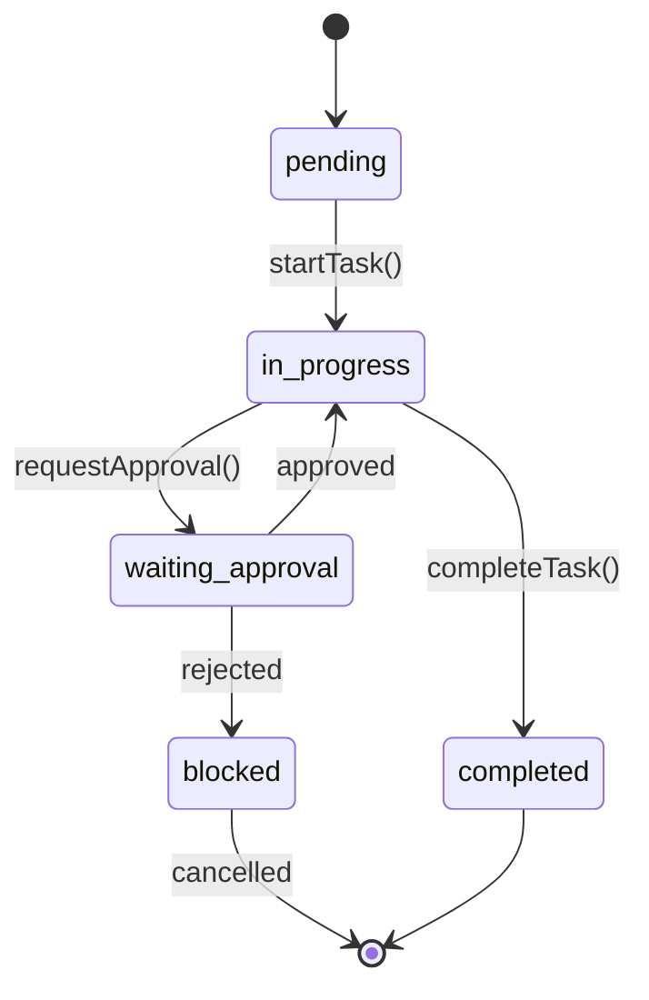
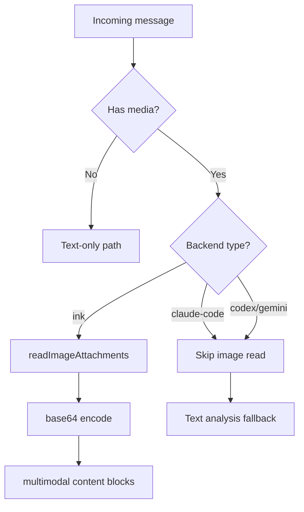
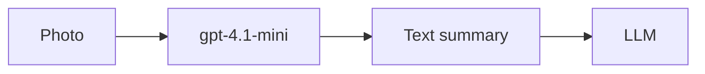
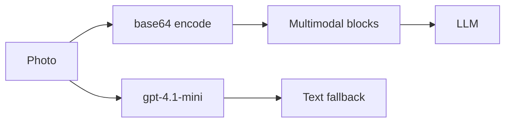

# PR Explainer

Generate Mermaid diagrams and structured visual summaries that explain what a pull request changes and why. Diagrams render natively in GitHub markdown — no extra tooling needed.

## When to Use

- When opening a PR that touches multiple files or modules
- When reviewing a PR and wanting to visualize the data flow or architecture changes
- When reporting on completed autonomous work (task groups, strategies)
- When someone asks "what does this PR do?" and code diffs aren't enough

## How to Generate

### Step 1: Fetch the PR diff

Use `mcp__github__pull_request_read` with `method: "get_diff"` to get the full diff. Also fetch `method: "get"` for the PR title, description, and commit count, and `method: "get_files"` for the changed file list.

### Step 2: Analyze the changes

Categorize what the PR does:

- **New modules/files**: What was added and what role does it play?
- **Modified interfaces**: What contracts changed (function signatures, types, API endpoints)?
- **Data flow changes**: How does data move differently now?
- **Dependency changes**: What new connections exist between modules?
- **Deleted code**: What was removed and why?

### Step 3: Choose diagram types

Pick 1-3 diagram types based on what best explains the changes:

#### Architecture / Module Dependency (most common)

Use when the PR adds or reorganizes modules, services, or packages.

````markdown
```mermaid
graph TD
    A[telegram-listener] -->|media attachments| B[gateway]
    B -->|SessionRequest| C[session-service]
    C -->|readImageAttachments| D[fs: base64 encode]
    D -->|ImageContent[]| E[ink-runner]
    E -->|multimodal blocks| F[Anthropic API]

    style D fill:#2d6a4f,stroke:#52b788
    style E fill:#2d6a4f,stroke:#52b788
```
````

#### Sequence Diagram

Use when the PR changes how components interact over time (request flows, message passing, async operations).

````markdown

````

#### State Diagram

Use when the PR changes lifecycle states, session phases, or status transitions.

````markdown

````

#### Flowchart with Decision Points

Use when the PR adds branching logic, routing, or conditional behavior.

````markdown

````

#### Before/After Comparison

Use when the PR refactors an existing flow. Show both as side-by-side diagrams.

````markdown
**Before:**



**After:**


````

### Step 4: Write the explanation

Structure your output as:

1. **One-sentence summary** of what the PR does
2. **Diagram(s)** — the Mermaid blocks from Step 3
3. **Key changes** — 3-5 bullet points explaining the most important modifications
4. **Impact** — what this enables or fixes for users

### Step 5: Post or embed

- **PR description**: Include diagrams directly in the PR body (GitHub renders Mermaid natively)
- **PR comment**: Post as a review comment for complex PRs that need visual explanation
- **Inbox update**: Include in `send_to_inbox` messages when reporting on autonomous work
- **Artifact**: Store as `create_artifact(uri: "ink://docs/<slug>", title: "...", content: "...")` for reference

## Diagram Style Guidelines

- Keep diagrams focused — one concept per diagram, max ~15 nodes
- Use descriptive node labels, not just file names (`readImageAttachments()` not `session-service.ts`)
- Highlight new/changed nodes with `style NodeName fill:#2d6a4f,stroke:#52b788` (green for additions)
- Highlight removed nodes with `style NodeName fill:#6b2c2c,stroke:#e57373` (red for deletions)
- Use subgraphs to group related modules (`subgraph SessionLayer`)
- Prefer `graph TD` (top-down) for hierarchical flows, `graph LR` (left-right) for pipelines
- For sequence diagrams, keep participants to 6 or fewer

## Example: Autonomous Task Report

When completing a task group autonomously, include a diagram in the completion report:

```
Task group "Multimodal Image Support" complete.

## Architecture

[mermaid diagram showing the pipeline]

## What shipped
- Core pipeline: Telegram → gateway → session-service → ink-runner → Anthropic API
- Gallery support via existing MediaGroupBuffer (up to 10 images)
- Backend gate: only ink runner reads images; CLI backends skip

## Test coverage
- 87 new tests across 3 files, full suite green (2441 tests)
```

This gives the reviewer (human or SB) immediate visual context without reading the full diff.
